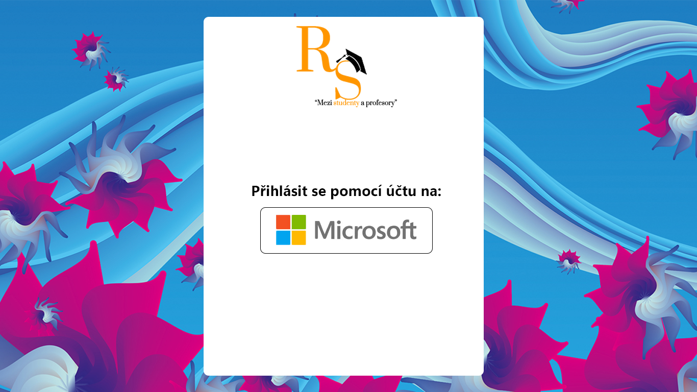
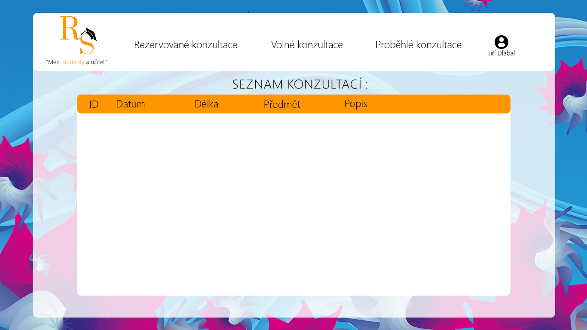
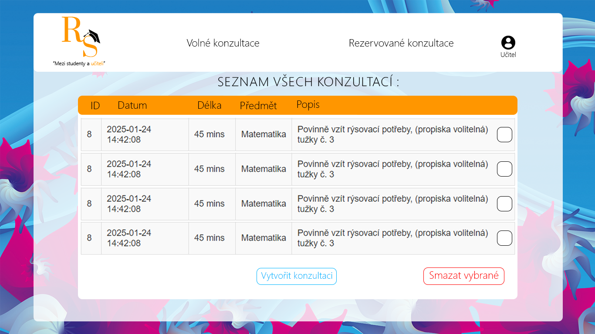
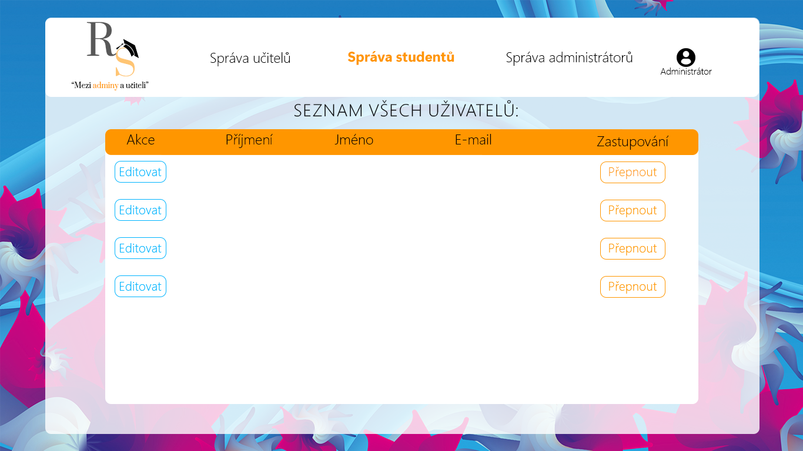
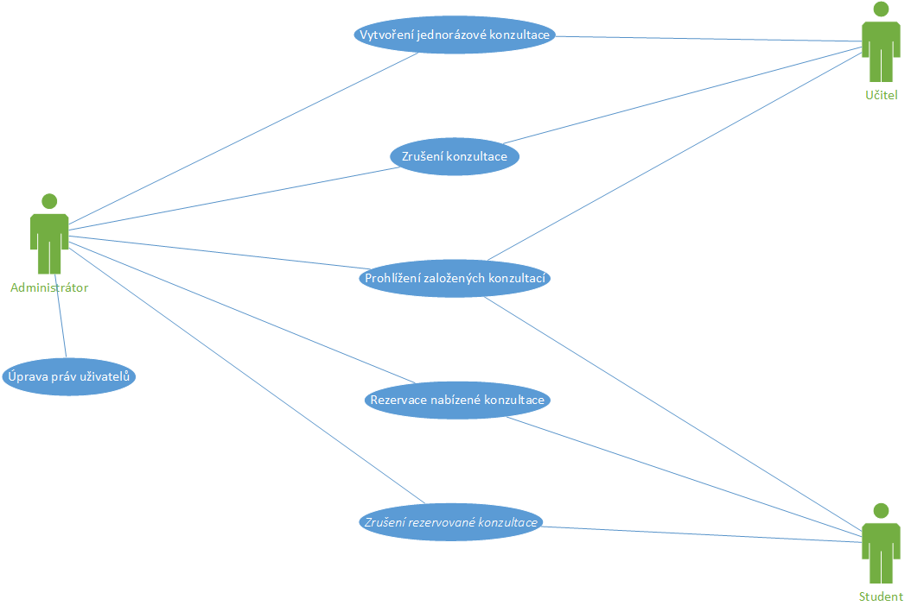
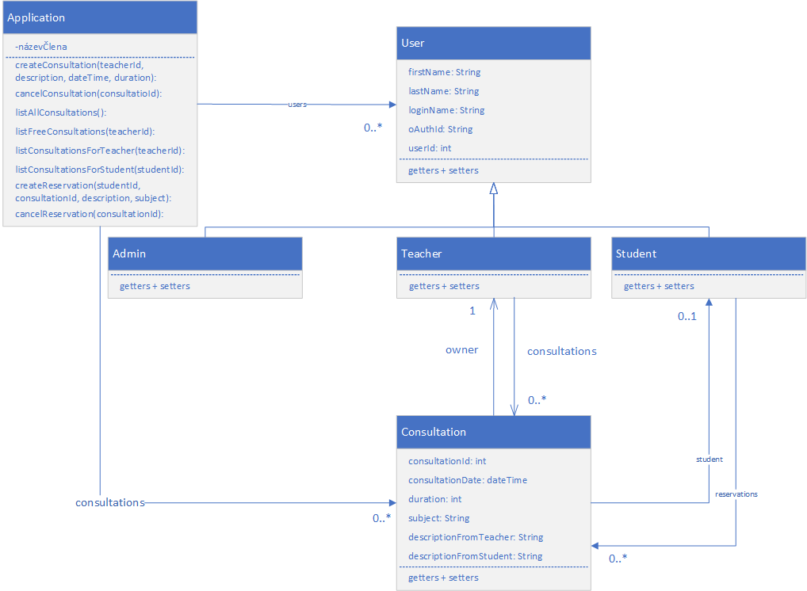
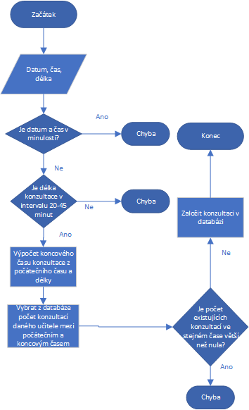
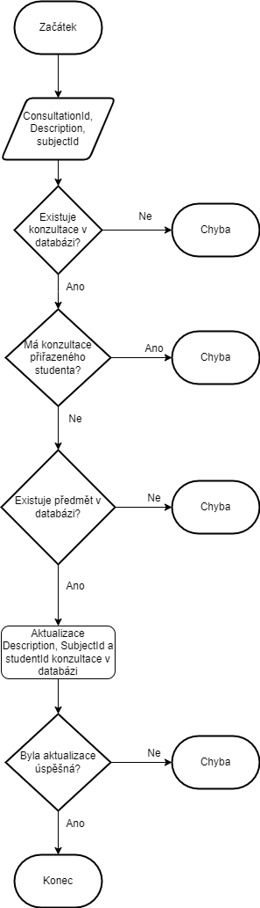
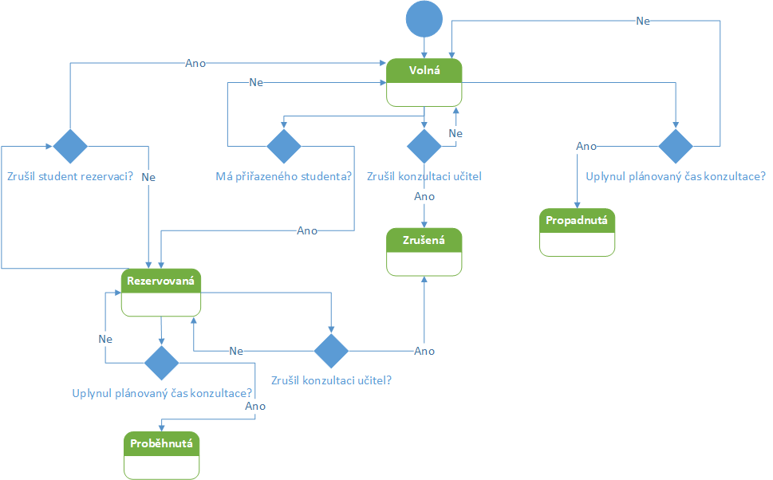
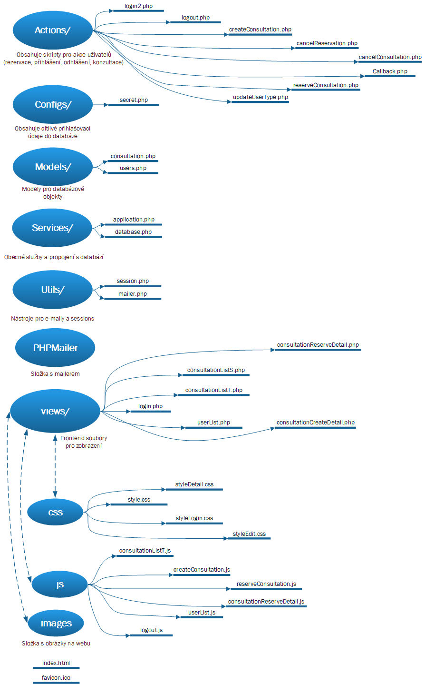

# Rezervační systém na konzultace

Tento rezervační systém na konzultace vznikl jako můj maturitní projekt na střední škole se zaměřením na IT. 
Cílem je usnadnit školám dohadování konzultací mezi učiteli a studenty pomocí přehledného webového rozhraní.

Systém je připraven k nasazení ve školním prostředí s podporou autentizace přes Microsoft účty a databází MariaDB/PostgreSQL. Díky rozdělení rolí mezi studenty, učitele a administrátory je možné systém snadno rozšířit i pro větší školní zařízení.

---

## 🚀 Funkce

- Přihlášení pomocí Microsoft účtu (OAuth 2.0)
- Rezervace a rušení konzultací (student)
- Vytváření a správa konzultací (učitel)
- Administrace uživatelů a impersonifikace (admin)
- Přehled rezervací a historie konzultací
- Emailové notifikace pomocí PHPMaileru

---


## 📸 Ukázky aplikace

| Přihlašovací obrazovka | Studenti - výběr konzultace |
|------------------------|------------------------------|
|  |  |

| Učitel - tvorba konzultace | Admin - seznam studentů |
|-----------------------------|--------------------------|
|  |  |

---

## 📦 Instalace a spuštění (dev)


### 📀 Instalace a nasazení

##### 1. Požadavky

PHP 8.1 nebo novější

Apache / Nginx

MariaDB nebo PostgreSQL

Git

Composer (pro PHPMailer)

Microsoft Entra ID (pro OAuth 2.0)

2. **Klonuj repozitář:**
   ```bash
   git clone https://github.com/DxProline/Reservation_System-ForConsultation.git
   cd Reservation_System-ForConsultation

##### 3. Konfigurace databáze

Vytvoř databázi (např. consultation_system)

Importuj SQL strukturu a demo data, pokud je poskytne autor

V souboru Configs/secret.php uprav připojení k databázi:

`define("DB_HOST", "localhost");`
`define("DB_NAME", "consultation_system");`
`define("DB_USER", "root");`
`define("DB_PASS", "heslo");`

 ##### 4. Konfigurace Microsoft OAuth

Přihlas se do Microsoft Entra

Získej TenantID tvé domény se kterou Microsoft komunikuje.

Zaregistruj novou aplikaci pro CLIENTID


Nastav callback URL:

`http://tvujWEB/Reservation_System-ForConsultation/Actions/callback.php`

Nastav oprávnění:

`openid`

`User.Read`

`email`

Vlož klientský ID a tajný klíč do Configs/secret.php:

`define("CLIENT_ID", "xxxx");`
`define("CLIENT_SECRET", "xxxx");`
`define("REDIRECT_URI", "http://tvujWEB/Reservation_System-ForConsultation/Actions/callback.php");`


## 👣 Uživatelský manuál – Jak systém používat

### Přihlášení do systému

Otevři stránku systému ve webovém prohlížeči

Klikni na tlačítko „Přihlásit se pomocí Microsoft účtu“

Po úspěšném přihlášení budeš automaticky zařazen jako student (výchozí role)

### Funkce podle role

__👤 Student__

Po přihlášení klikni na „Volné konzultace“

Vyber konzultaci a klikni na „Rezervovat“

Vyplň předmět a popis problému (nepovinné)

Potvrď rezervaci → obdržíš e-mail

Konzultaci lze zrušit v sekci „Rezervované konzultace“

__👨‍🏫 Učitel__

Klikni na „Vytvořit konzultaci“

Vyplň datum, čas, délku, předmět a popis

Systém automaticky zabrání konfliktům v čase

Sleduj přihlášené studenty v sekci „Rezervované konzultace“

V případě nutnosti zruš konzultaci → student dostane e-mail

__👨‍💼 Administrátor__

Otevři „Seznam uživatelů“

Můžeš měnit role student/učitel/admin

Funkce „Impersonifikace“ ti umožní přihlásit se jako jiný uživatel

Sleduj historii konzultací nebo zakládej konzultace za ostatní


##### 5. PHPMailer

Otevři terminál v root adresáři projektu

Spusť:

`composer require phpmailer/phpmailer`

Uprav SMTP konfiguraci v Utils/mailer.php


## 📊 UML a systémové diagramy

### 1. Diagram případů použití


Diagram se využívá k definici hlavních funkcí a rolí jednotlivých uživatelů systému – učitel, student, administrátor – a jejich interakcí s aplikací.

---

### 2. Diagram tříd


Znázorňuje strukturu systému pomocí tříd, jejich atributů, metod a vztahů. Např. student si může zarezervovat konzultaci, učitel konzultaci vytvoří.

---

### 3. Vývojový diagram – Vytvoření konzultace učitelem


Zobrazuje logiku systému při vytváření konzultace učitelem. Obsahuje rozhodovací větve (např. zda má učitel konzultaci ve stejný čas).

---

### 4. Vývojový diagram – Rezervace konzultace studentem


Ukazuje, jak student rezervuje konzultaci. Systém ověřuje kolize v čase, dostupnost a zajišťuje hladký průběh rezervace.

---

### 5. Sekvenční diagram – Vytvoření konzultace učitelem


Znázorňuje posloupnost zpráv mezi objekty při vytváření konzultace – např. interakce mezi formulářem, serverem a databází.

---

### 6. Sekvenční diagram – Objednání konzultace studentem


Sekvenčně popisuje, jak student zadává požadavek, jak server kontroluje pravidla a vrací odpověď.

---

### 7. Stavový diagram – Správa konzultací


Znázorňuje životní cyklus konzultace – od jejího vytvoření přes rezervaci a případné zrušení až po proběhlý stav.

---

### 8. Hierarchický diagram souborů


Zachycuje organizaci kódu a rozložení složek v projektu. Napomáhá k rychlé orientaci v systému a oddělení zodpovědností.

---

## 🛡️ Bezpečnost

Soubory jako `secret.php`, `database.php` a jiné citlivé konfigurace jsou chráněny `.gitignore` a **nejsou součástí** tohoto veřejného repozitáře.

---


🔧 Dokumentace kódu (vybrané akce)

`createConsultation.php`

Slouží k přidání nové konzultace učitelem

Validuje datum/čas, vkládá do tabulky consultations

`reserveConsultation.php`

Rezervace konzultace studentem

Odesílá notifikaci pomocí PHPMaileru studentovi i učiteli

`cancelConsultation.php`

Učitel nebo admin ruší konzultaci

Notifikace se odesílá studentům (pokud byli přihlášeni)

`cancelReservation.php`

Student ruší svou rezervaci

Učitel je o zrušení informován

`updateUserType.php`

Admin mění roli uživatele (0=student, 1=učitel, 2=admin)

`callback.php`

Ošetřuje navrácení uživatele z Microsoft OAuth loginu

Zaznamená uživatele do databáze, pokud je nový

**Verze**

__1.0__

První stabilní verze s plnou funkcionalitou

_2025_

**💼 Licence**

Projekt je tvořen DxProlinem (mnou) je tedy sice OpenSource ale při zavedení ve školních systémech si autor vyhrazuje právo na budoucí zpoplatnění podle jeho uvážení.

**🙏 Poděkování**

Velké díky patří panu učiteli na Programování na mé škole, [@kubavojak](https://github.com/kubavojak) za podněty k zabezpečení a jeho přítelkyni za grafický vizuál.


# ENG: Reservation\_System-Consultation

This consultation reservation system was developed as my graduation project at a high school specializing in IT.
The goal is to simplify the scheduling of consultations between teachers and students through a clear and user-friendly web interface.

The system is ready for deployment in a school environment, supporting Microsoft account authentication and MariaDB/PostgreSQL database integration. Thanks to role separation between students, teachers, and administrators, the system can easily scale for larger institutions.

---

## 🚀 Features

* Login via Microsoft account (OAuth 2.0)
* Students can book and cancel consultations
* Teachers can create and manage consultations
* Admins can manage users and impersonate roles
* Overview of reservations and history
* Email notifications via PHPMailer

---

## 📸 Application Screenshots

| Login Screen        | Students – Select Consultation |
| ------------------- | ------------------------------ |
|  |     |

| Teacher – Create Consultation | Admin – User List         |
| ----------------------------- | ------------------------- |
|     |  |

---

## 📆 Installation and Deployment (Dev)

### 📀 Requirements

* PHP 8.1 or newer
* Apache / Nginx
* MariaDB or PostgreSQL
* Git
* Composer (for PHPMailer)
* Microsoft Entra ID (for OAuth 2.0)

### => Clone the repository:

```bash
git clone https://github.com/DxProline/Reservation_System-ForConsultation.git
cd Reservation_System-ForConsultation
```

### => Database Configuration

* Create a database (e.g. `consultation_system`)
* Import SQL schema and demo data if provided by the author
* In `Configs/secret.php`, set your database credentials:

```php
define("DB_HOST", "localhost");
define("DB_NAME", "consultation_system");
define("DB_USER", "root");
define("DB_PASS", "your_password");
```

### => Microsoft OAuth Configuration

1. Login to [Microsoft Entra](https://entra.microsoft.com)
2. Register a new application to obtain your CLIENT\_ID
3. Retrieve your domain's TenantID
4. Set the callback URL:

```
http://yourWEB/Reservation_System-ForConsultation/Actions/callback.php
```

5. Grant permissions:

   * `openid`
   * `User.Read`
   * `email`
6. Fill in the credentials in `Configs/secret.php`:

```php
define("CLIENT_ID", "xxxx");
define("CLIENT_SECRET", "xxxx");
define("REDIRECT_URI", "http://yourWEB/Reservation_System-ForConsultation/Actions/callback.php");
```

### => PHPMailer

1. Open terminal in project root
2. Run:

```bash
composer require phpmailer/phpmailer
```

3. Edit SMTP settings in `Utils/mailer.php`

---

## 👣 User Guide – How to Use the System

### Login to the System

* Open the system website in your browser
* Click on **"Sign in with Microsoft account"**
* Upon successful login, you are automatically assigned the default role: student

### Role-Based Functionality

**👤 Student**

* After login, go to "Available Consultations"
* Select a consultation and click "Reserve"
* Fill in the subject and problem description (optional)
* Confirm the reservation → you will receive an email
* You can cancel your booking in the "Reserved Consultations" section

**👨‍🏫 Teacher**

* Click on "Create Consultation"
* Enter date, time, duration, subject, and description
* The system prevents time conflicts
* Monitor registered students in the "Reserved Consultations" section
* If needed, cancel a consultation → the student is notified via email

**👨‍💼 Administrator**

* Open the "User List"
* Change user roles (student/teacher/admin)
* Use the "Impersonate" feature to log in as another user
* Monitor consultation history or create bookings on behalf of others

---

## 📊 UML and System Diagrams

### 1. Use Case Diagram  


This diagram defines the main system functions and the roles of individual users – teacher, student, and administrator – and their interactions with the application.

---

### 2. Class Diagram  


This diagram illustrates the system's structure through classes, their attributes, methods, and relationships. For example, a student can reserve a consultation, and a teacher can create it.

---

### 3. Activity Diagram – Creating a Consultation by Teacher  


Describes the system logic when a teacher creates a consultation. Includes decision branches (e.g., whether the teacher already has a consultation at the same time).

---

### 4. Activity Diagram – Reserving a Consultation by Student  


Shows how a student reserves a consultation. The system checks for scheduling conflicts and availability to ensure a smooth booking process.

---

### 5. Sequence Diagram – Consultation Creation by Teacher  


Illustrates the sequence of messages exchanged between components during consultation creation – e.g., interaction between form, server, and database.

---

### 6. Sequence Diagram – Consultation Booking by Student  


Describes the time-ordered communication as a student submits a booking request, and the server performs checks and returns responses.

---

### 7. State Diagram – Consultation Management  


Shows the lifecycle of a consultation – from creation, through booking and possible cancellation, to completion.

---

### 8. File Hierarchy Diagram  


Illustrates the code structure and organization of folders in the project. Helps with quick orientation and responsibility separation across components.

---

## 🛡️ Security

Files like `secret.php`, `database.php`, and other sensitive configurations are protected by `.gitignore` and are **not included** in this public repository.


## 🔧 Code Documentation (Key Scripts)

`createConsultation.php`

* Used by teachers to create a new consultation
* Validates date/time, inserts into `consultations` table

`reserveConsultation.php`

* Student books a consultation
* Sends email notification to student and teacher via PHPMailer

`cancelConsultation.php`

* Consultation is cancelled by a teacher or admin
* Students (if booked) are notified

`cancelReservation.php`

* Student cancels their reservation
* Teacher is notified of the cancellation

`updateUserType.php`

* Admin changes user role (0 = student, 1 = teacher, 2 = admin)

`callback.php`

* Handles Microsoft OAuth login return
* Adds the user to the database if not present

---

## 🗓 Version

**1.0**
Initial stable version with full functionality
*2025*

---

## 💼 License

This project was developed by DxProline (myself). While it is open-source, the author reserves the right to charge for future usage in institutional school systems.

---

## 🙏 Acknowledgements

Special thanks to my programming teacher at school, [@kubavojak](https://github.com/kubavojak), for his security insights, and to his partner for the visual design.

